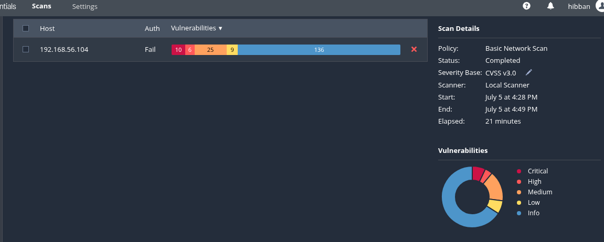
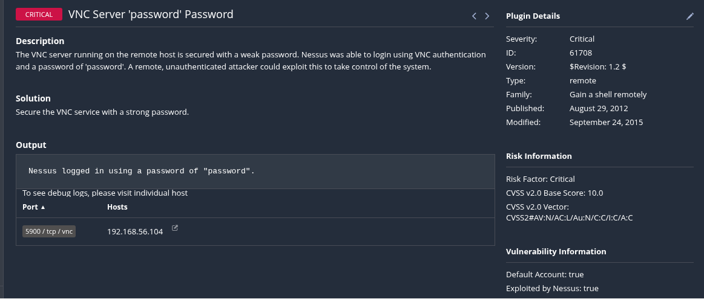

# Nessus Vulnerability Assessment

## Project Overview

**Nama Project:** Vulnerability Assessment dengan Nessus  
**Tujuan:** Mengidentifikasi celah keamanan pada sistem target menggunakan Nessus Vulnerability Scanner.  
**Tanggal Pelaksanaan:** 05/07/2025

---

## Instalasi Nessus

Download nessus di https://www.tenable.com/downloads

Jalankan di terminal

```bash
sudo dpkg -i Nessus-10.9.0-debian6_amd64.deb
sudo systemctl start nessusd
sudo systemctl enable nessusd
```

Buka browser ke : https://localhost:8834

Register dengan Nessus Essentials (gratis)

---

## Environment

| Komponen    | Detail                           |
| ----------- | -------------------------------- |
| **Scanner** | Kali Linux (Nessus v10.9)        |
| **Target**  | Metasploitable2 (192.168.56.104) |
| **Network** | Host-only                        |

---

## Scan Configuration

- **Scan Type:** Basic Network Scan
- **Targets:** `192.168.56.104`
- **Port Range:** Default (0-65535)
- **Credential:** Tidak digunakan (unauthenticated scan)
- **Plugins:** All enabled (default Nessus)

---

## Execution

- Scan dijalankan pada tanggal 05/07/2025 pukul 16:28 WIB.
- Durasi scanning: ±21 menit.

---

## Findings Summary

| Severity | Count |
| -------- | ----- |
| Critical | 8     |
| High     | 5     |
| Medium   | 19    |
| Low      | 8     |
| Info     | 78    |

---

## Findings

### 1️. VNC Server menggunakan password ‘password’

- **Severity:** Critical
- **Deskripsi:**
  VNC server terdeteksi menggunakan password default atau sangat lemah ('password'), yang memungkinkan attacker login ke remote desktop GUI tanpa brute-force.
- **Rekomendasi Mitigasi:**
  - Ganti password VNC dengan kombinasi yang panjang & kompleks.
  - Batasi akses hanya dari IP tertentu menggunakan firewall.
  - Gunakan SSH tunnel untuk mengakses VNC secara aman.

---

### 2️. rlogin Service Detected

- **Severity:** High
- **Deskripsi:**
  Service `rlogin` ditemukan aktif pada port 513/tcp. Protokol ini tidak aman karena semua data (termasuk credential) dikirim plaintext, sehingga rentan di-sniff dan disalahgunakan via file `.rhosts`.
- **Rekomendasi Mitigasi:**
  - Nonaktifkan service rlogin pada server.
  - Hapus paket `rsh-server` jika tidak digunakan.
  - Migrasi akses remote shell ke SSH yang terenkripsi.

---

### 3️. Unencrypted Telnet Server

- **Severity:** Medium\* (default Nessus)
- **Deskripsi:**
  Telnet service terdeteksi pada port 23/tcp. Telnet mengirimkan username & password dalam plaintext, mudah di-sniff oleh attacker dengan tools seperti Wireshark. Dalam audit manual umumnya dikategorikan sebagai High.
- **Rekomendasi Mitigasi:**
  - Nonaktifkan Telnet service pada server.
  - Gunakan SSH dengan authentication key untuk remote login.
  - Terapkan firewall rule agar hanya IP tertentu yang bisa mengakses SSH.

---

## Screenshots

| Gambar                               | Deskripsi                                      |
| ------------------------------------ | ---------------------------------------------- |
|    | Tampilan dashboard Nessus setelah scan selesai |
|  | Detail salah satu temuan vulnerability         |

---

## Summary Recommendations

Secara keseluruhan, rekomendasi mitigasi utama adalah:

- Nonaktifkan dan hapus semua service legacy yang tidak terenkripsi (seperti Telnet dan rlogin) untuk menghilangkan risiko credential exposure.
- Terapkan SSH dengan konfigurasi strong authentication (password policy ketat atau key-based).
- Gunakan firewall untuk membatasi akses hanya dari IP terpercaya ke semua port remote administration.
- Implementasikan VPN atau tunneling jika diperlukan akses remote ke desktop (misalnya VNC), guna memastikan lalu lintas terenkripsi.
- Lakukan vulnerability scanning dan patching secara berkala untuk menjaga sistem tetap secure.

---

## Attachments

- [Laporan PDF Nessus](nessus_report.pdf)
- [File scan .nessus](scan_file.nessus)

---

## Conclusion

Hasil pemeriksaan menunjukkan adanya layanan yang tidak terenkripsi dan penggunaan kredensial default yang dapat dieksploitasi untuk mendapatkan akses tidak sah ke sistem. Diperlukan tindakan mitigasi segera dengan menonaktifkan service legacy, memperkuat autentikasi, serta menerapkan protokol aman guna meminimalkan risiko kompromi.

---

## _Ditulis oleh:_

**Ibnu Hibban Dzulfikri**
LinkedIn: https://www.linkedin.com/in/ibnu-hibban-dzulfikri-b51a7824a

---
